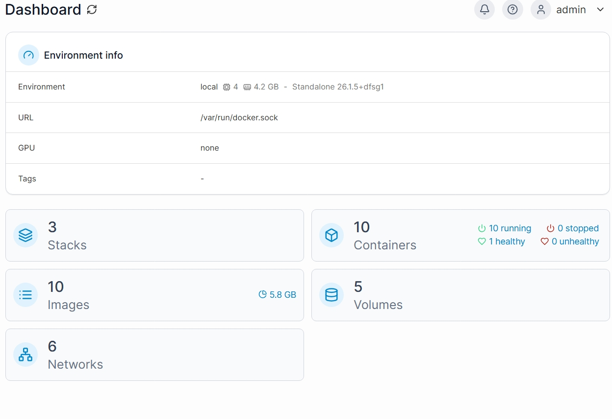

# Raspberry Pi 5 Homelab Nerv
Mein Raspberrypi 5 Homelab Projekt. Das Projekt beinhaltet Dienste wie Monitoring, eine Reverse Proxy Struktur und eine private Cloud.

## Hardware:

### Server: 
        Raspberry Pi 5
        4GB RAM
        Running Rasberry Pi OS

## Software :

### Services auf dem Docker: 
        Nextcloud (Cloud)
        Pi-hole (Adblock DNS)
        Prometheus (Monitoring)
        Grafana (Monitoring Dashboard)
        Portainer (Docker Management)
        Nginx Proxy Manager (Reverse Proxy)

### Domain: 
        nervhome.com
        nextcloud.nervhome.com

## Architektur: 
        Der Zugriff erfolgt durch Cloudflare Tunnel dar ich keine Kontrolle über den Router habe.     
              
              Cloudflare Tunnel -> Nginx Reverse Proxy -> Docker Containers

## Screenshots
        ### Pihole Dashboard        
        
        #### Grafana Monitoring 
        
        ### Protainer Docker Managment
        
        
             
## Ziele von dem Projekt:

                       Optimierung der Collabora etc. für bessere Auslastung des Rasberry Pi 
                       Automatische Backups der Cloud
                       Passwort manager
                       API Gateway
                  
